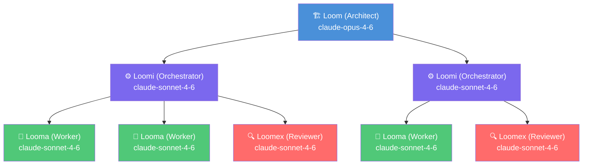

# Loomflo

An open-source AI Agent Orchestration Framework. Describe your project in plain language, and Loomflo transforms it into working software through teams of AI agents operating in a directed graph.

## How It Works

Loomflo runs as a persistent daemon with two phases:

1. **Phase 1 — Spec Generation**: An Architect agent (Loom) generates a complete specification suite from your project description — constitution, functional spec, technical plan, task breakdown, coherence analysis, and an execution graph.

2. **Phase 2 — Execution**: The graph executes node by node. Each node is managed by an Orchestrator (Loomi) that spawns Worker agents (Loomas) in parallel with exclusive file scopes. An optional Reviewer (Loomex) validates output. Failed nodes retry with adapted prompts; blocked nodes escalate to the Architect for graph modification.

## Architecture

```
┌─────────────────────────────────────────────────────────────────┐
│                         Loomflo Daemon                          │
│                                                                 │
│  ┌─────────┐    ┌──────────────────────────────────────────┐    │
│  │  Loom   │    │           Execution Engine                │    │
│  │ (Arch.) │    │                                          │    │
│  │         │    │  ┌────────┐  ┌────────┐  ┌────────┐     │    │
│  │ • Spec  │    │  │ Node 1 │→ │ Node 2 │→ │ Node 3 │     │    │
│  │   Gen   │    │  │        │  │        │  │        │     │    │
│  │ • Chat  │    │  │ Loomi  │  │ Loomi  ���  │ Loomi  │     │    │
│  │ • Graph │    │  │ ├Looma │  │ ├Looma │  │ ├Looma │     │    │
│  │   Mods  │    │  │ ├Looma │  │ ├Looma │  │ └Loomex│     │    │
│  │ • Escal.│    │  │ └Loomex│  │ └Loomex│  ��        │     │    │
│  └─────────┘    │  └────────┘  └────────┘  └────────┘     │    │
│                 └──────────────────────────────────────────┘    │
│                                                                 │
│  ┌──────────────┐  ┌──────────────┐  ┌───────────────────┐     │
│  │ REST API     │  │ WebSocket    │  │ Shared Memory     │     │
│  │ (Fastify)    │  │ (Real-time)  │  │ (.md files)       │     │
│  └──────────────┘  └──────────────┘  └───────────────────┘     │
└─────────────────────────────────────────────────────────────────┘
        │                    │
   ┌────┴────┐          ┌───┴────┐
   │   CLI   │          │Dashboard│
   │(loomflo)│          │ (React) │
   └─────────┘          └────────┘
```

### Agent Hierarchy



### Monorepo Structure

```
packages/
├── core/          Engine, agents, tools, providers, persistence
├── cli/           Command-line interface (loomflo)
├── dashboard/     Web dashboard (React + React Flow + TailwindCSS)
└── sdk/           Public SDK (loomflo-sdk)
```

## Quickstart

```bash
# 1. Set your API key
export ANTHROPIC_API_KEY=sk-ant-your-key-here

# 2. Start the daemon
loomflo start

# 3. Initialize a project
loomflo init "Build a REST API with auth, user management, and PostgreSQL"
```

The daemon generates a complete spec suite and execution graph. Review everything in the dashboard, confirm, and watch your project build itself.

## Installation

### From npm

```bash
npm install -g loomflo
```

### From source

```bash
git clone https://github.com/loomflo/loomflo.git
cd loomflo
pnpm install
pnpm build
```

### Docker

```bash
docker compose up -d
```

## Usage Example

```bash
# Start the daemon
loomflo start

# Generate specs for a new project
loomflo init "Build a todo app with React frontend, Express backend, and SQLite"

# Open the dashboard to review the spec and execution graph
loomflo dashboard

# Chat with the Architect during spec review
loomflo chat "use Tailwind for styling instead of plain CSS"

# Check workflow status and costs
loomflo status

# Give instructions during execution
loomflo chat "use bcrypt for password hashing, not argon2"

# View agent logs for a specific node
loomflo logs node-3

# If the daemon is interrupted, resume from where it left off
loomflo resume

# Adjust configuration mid-execution
loomflo config set reviewerEnabled false
loomflo config set budgetLimit 20

# Stop the daemon gracefully
loomflo stop
```

## CLI Commands

| Command                            | Description                                        |
| ---------------------------------- | -------------------------------------------------- |
| `loomflo start`                    | Start the daemon (detached)                        |
| `loomflo stop`                     | Stop the daemon gracefully                         |
| `loomflo init "description"`       | Generate spec + execution graph from a description |
| `loomflo chat "message"`           | Chat with the Architect agent                      |
| `loomflo status`                   | Show workflow state, active nodes, costs           |
| `loomflo resume`                   | Resume an interrupted workflow                     |
| `loomflo dashboard`                | Open the web dashboard in your browser             |
| `loomflo logs [node-id]`           | View agent logs (optionally filtered by node)      |
| `loomflo config set <key> <value>` | Set a configuration value                          |
| `loomflo config get <key>`         | Get a configuration value                          |

## Dashboard

The web dashboard provides real-time visibility into the entire workflow:

- **Graph View** — Interactive node graph with live status updates (React Flow)
- **Node Detail** — Agent activity, file scopes, logs, review reports, costs
- **Spec Viewer** — Browse all generated spec artifacts as formatted Markdown
- **Shared Memory** — View the memory files agents use for cross-node context
- **Cost Dashboard** — Per-agent token usage, per-node costs, budget gauge
- **Chat** — Converse with the Architect agent in real time
- **Config** — Edit configuration with live validation

## Workflow Lifecycle

```
loomflo init       loomflo start       Nodes execute
    │                   │                   │
    ▼                   ▼                   ▼
  ┌────┐  specs   ┌─────────┐  confirm  ┌─────────┐  all done  ┌──────┐
  │init│ ──────→  │building │ ───────→  │ running │ ────────→  │ done │
  └────┘  ready   └─────────┘           └─────────┘            └──────┘
                                            │  ▲
                                    pause/  │  │  resume/
                                    budget  ▼  │  budget
                                        ┌────────┐
                                        │ paused │
                                        └────────┘
```

## Configuration

Loomflo uses a 3-level configuration system. Each level overrides the previous:

1. **Global** — `~/.loomflo/config.json` (applies to all projects)
2. **Project** — `.loomflo/config.json` in the project root
3. **CLI flags** — one-time overrides at the command line

### Configuration Options

| Key                 | Type           | Default             | Description                                          |
| ------------------- | -------------- | ------------------- | ---------------------------------------------------- |
| `models.loom`       | string         | `claude-opus-4-6`   | Model for the Architect agent                        |
| `models.loomi`      | string         | `claude-sonnet-4-6` | Model for Orchestrator agents                        |
| `models.looma`      | string         | `claude-sonnet-4-6` | Model for Worker agents                              |
| `models.loomex`     | string         | `claude-sonnet-4-6` | Model for Reviewer agents                            |
| `reviewerEnabled`   | boolean        | `true`              | Enable/disable the review step                       |
| `budgetLimit`       | number \| null | `null`              | Max spend in USD (pauses workflow when reached)      |
| `defaultDelay`      | string         | `"0"`               | Delay between nodes (`"0"`, `"30m"`, `"1h"`, `"1d"`) |
| `maxRetriesPerNode` | number         | `3`                 | Max retry attempts per node                          |
| `maxRetriesPerTask` | number         | `2`                 | Max retry attempts per individual task               |
| `dashboardPort`     | number         | `3000`              | Port for the daemon and dashboard                    |

### Example Configuration

```json
{
  "models": {
    "loom": "claude-opus-4-6",
    "loomi": "claude-sonnet-4-6",
    "looma": "claude-sonnet-4-6",
    "loomex": "claude-sonnet-4-6"
  },
  "reviewerEnabled": true,
  "budgetLimit": 25,
  "defaultDelay": "0",
  "dashboardPort": 3000
}
```

Mid-execution configuration changes take effect at the next node activation — in-progress nodes complete with their original settings.

## Spec Artifacts

When you run `loomflo init`, the Architect generates six artifacts:

| Artifact             | Purpose                                                          |
| -------------------- | ---------------------------------------------------------------- |
| `constitution.md`    | Non-negotiable quality principles for the target project         |
| `spec.md`            | Functional specification — user stories, features, constraints   |
| `plan.md`            | Technical plan — stack, architecture, data model, file structure |
| `tasks.md`           | Ordered task list with file paths and parallelism flags          |
| `analysis-report.md` | Coherence analysis — coverage gaps, duplications, ambiguities    |
| `workflow.json`      | Execution graph — nodes, edges, topology, per-node instructions  |

## Graph Topologies

Loomflo supports multiple graph structures from the same execution engine:

- **Linear** — A → B → C (sequential)
- **Divergent** — A → [B, C] (parallel branches)
- **Convergent** — [B, C] → D (wait for all predecessors)
- **Tree** — hierarchical with multiple branches
- **Mixed** — any combination of the above

## Agent Tools

Each agent has access to a sandboxed set of tools:

| Tool              | Description                                   |
| ----------------- | --------------------------------------------- |
| `read_file`       | Read file content from the workspace          |
| `write_file`      | Create or overwrite a file (scope-enforced)   |
| `edit_file`       | String replacement in a file (scope-enforced) |
| `search_files`    | Regex/glob content search                     |
| `list_files`      | Glob pattern file listing                     |
| `exec_command`    | Sandboxed shell execution                     |
| `read_memory`     | Read shared memory files                      |
| `write_memory`    | Append to shared memory files                 |
| `send_message`    | Message another agent in the same node        |
| `report_complete` | Signal task completion                        |
| `escalate`        | Request graph modification from the Architect |

All tools enforce workspace isolation — agents cannot access files outside their project directory. Write operations are restricted to the agent's assigned file scope.

## SDK

The `loomflo-sdk` package provides programmatic access:

```typescript
import { LoomfloClient } from "loomflo-sdk";

const client = new LoomfloClient({
  baseUrl: "http://127.0.0.1:3000",
  token: "your-auth-token",
});

// Initialize a project
const workflow = await client.init("Build a REST API with auth");

// Listen to real-time events
client.onEvent("node_status", (event) => {
  console.log(`Node ${event.nodeId}: ${event.status}`);
});

// Chat with the Architect
const response = await client.chat("How is authentication being implemented?");

// Check status
const status = await client.status();
console.log(`Cost: $${status.totalCost} | Nodes: ${status.completedNodes}/${status.totalNodes}`);
```

## Security

- **Workspace isolation** — each project is sandboxed to its own directory
- **Shell sandbox** — path traversal attempts are detected and rejected
- **Secret management** — API keys from environment variables only, never logged or persisted
- **Network binding** — daemon listens on `127.0.0.1` only (configurable to `0.0.0.0` for Docker)
- **Write scope enforcement** — agents can only write to their assigned file patterns
- **Token-based auth** — auto-generated token stored in `~/.loomflo/daemon.json`

## Development

```bash
# Install dependencies
pnpm install

# Build all packages
pnpm build

# Run tests
pnpm test

# Lint
pnpm lint

# Type check
pnpm run typecheck
```

### Tech Stack

- **Runtime**: Node.js (LTS), TypeScript 5.x (strict mode, ESM)
- **Package manager**: pnpm workspaces + Turborepo
- **API server**: Fastify 5.x with WebSocket support
- **Dashboard**: React 19 + React Flow v12 + TailwindCSS 4.x + Vite 6.x
- **Testing**: Vitest (60%+ coverage enforced)
- **Validation**: Zod for runtime schema validation
- **LLM provider**: Anthropic Claude (default), extensible via `LLMProvider` interface

## Provider Support

| Provider         | Status    | Notes                                                                             |
| ---------------- | --------- | --------------------------------------------------------------------------------- |
| Anthropic Claude | Supported | Default provider. claude-opus-4-6 for Architect, claude-sonnet-4-6 for all others |
| OpenAI           | Planned   | Interface stub exists                                                             |
| Ollama (local)   | Planned   | Interface stub exists                                                             |

Swapping providers requires only a configuration change — zero code modifications.

## License

[MIT](LICENSE)
